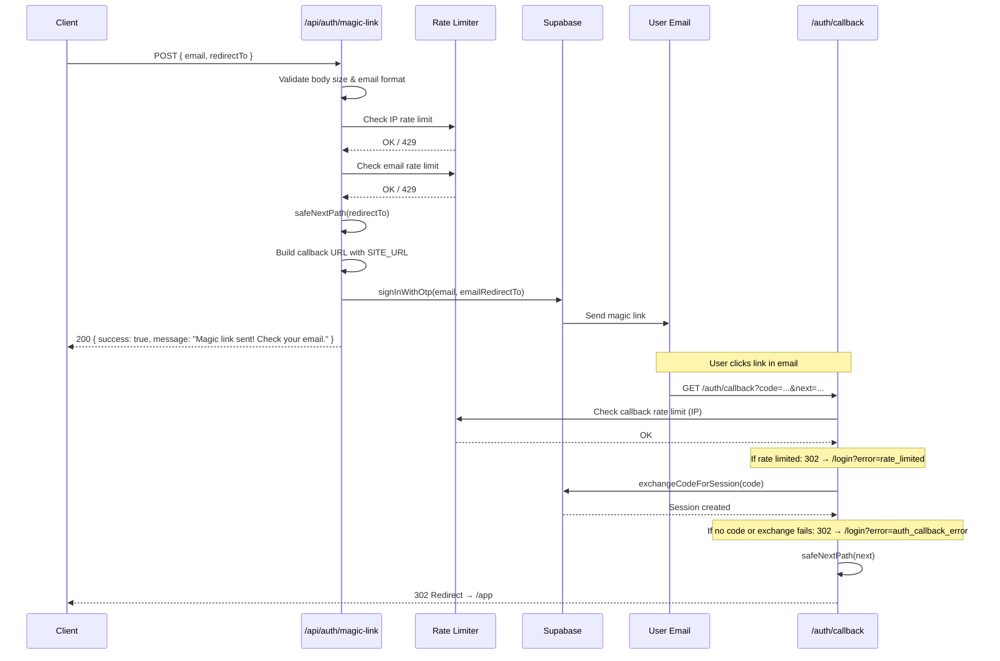

# Magic Link Authentication Flow

> **If this documentation disagrees with code, the code wins.**
> This document was derived from Codemap `Magic_Link_Authentication_Flow_20251231_112352`.
> Codemaps may become stale; always verify against the actual implementation.

## Overview

Passwordless authentication via email magic links using Supabase OTP.

## Flow Summary

```
POST /api/auth/magic-link
         │
         ▼
   ┌─────────────┐
   │  Validate   │ ← body size, email format
   └─────────────┘
         │
         ▼
   ┌─────────────┐
   │ Rate Limit  │ ← IP + email (dual-layer)
   └─────────────┘
         │
         ▼
   ┌─────────────┐
   │ Build URL   │ ← safeNextPath + SITE_URL
   └─────────────┘
         │
         ▼
   ┌─────────────┐
   │  Supabase   │ → signInWithOtp → email sent
   └─────────────┘
         │
    (user clicks link)
         │
         ▼
   /auth/callback?code=...&next=/app
         │
         ▼
   exchangeCodeForSession
         │
         ▼
   Redirect → /app (or safe path)
```

## Step-by-Step Flow

1. **Client sends POST `/api/auth/magic-link`** with `{ email, redirectTo? }`
2. **Request validation**
   - Body size check (max 10KB)
   - Email field required
   - RedirectTo capped at 2048 characters
   - Email format validation (regex)
   - Email sanitization (trim + lowercase)
3. **Dual-layer rate limiting**
   - Check IP rate limit (`ip:{clientIp}`)
   - Check email rate limit (`email:{sanitizedEmail}`)
   - Returns 429 if either limit exceeded
4. **Build safe redirect URL**
   - Validate `redirectTo` via `safeNextPath()` (open redirect prevention)
   - Get trusted `SITE_URL` from environment (tries `SITE_URL`, falls back to `NEXT_PUBLIC_SITE_URL`)
   - Construct: `{SITE_URL}/auth/callback?next={safeRedirect}`
5. **Supabase signInWithOtp** sends magic link email
6. **User clicks email link** → redirected to `/auth/callback?code=...&next=...`
7. **Callback handler (`/auth/callback`)**
   - Rate limits callback by IP
   - Exchanges code for session via Supabase
   - Validates `next` param via `safeNextPath()`
   - Redirects to `/app` (or validated path)

## Sequence Diagram



## Security Guarantees

- [ ] **Body size cap** — Requests >10KB rejected (413) — [`route.ts:33`](../src/app/api/auth/magic-link/route.ts#L33)
- [ ] **IP rate limiting** — Per-IP limit via Upstash Redis (5 req/15min default) — [`route.ts:69`](../src/app/api/auth/magic-link/route.ts#L69)
- [ ] **Email rate limiting** — Per-email limit prevents targeting specific users — [`route.ts:88`](../src/app/api/auth/magic-link/route.ts#L88)
- [ ] **Supabase rate limiting** — Supabase's own rate limits checked; returns 429 if exceeded — [`route.ts:128`](../src/app/api/auth/magic-link/route.ts#L128)
- [ ] **Open redirect prevention** — `safeNextPath()` rejects protocols, `//`, non-`/app` paths — [`utils.ts:24`](../src/lib/utils.ts#L24)
- [ ] **Trusted SITE_URL** — Callback URL built from server env, not `Origin` header — [`route.ts:112`](../src/app/api/auth/magic-link/route.ts#L112)
- [ ] **Cache-Control: no-store** — All responses include no-cache headers — [`route.ts:18`](../src/app/api/auth/magic-link/route.ts#L18)
- [ ] **Fail-closed rate limiting** — Production blocks requests if Redis unavailable — [`rate-limit.ts:107`](../src/lib/rate-limit.ts#L107)
- [ ] **Callback rate limiting** — `/auth/callback` rate-limited by IP (separate bucket: `auth-callback:ip:`) — [`callback/route.ts:9`](../src/app/auth/callback/route.ts#L9)

## Code References

| Component | File | Key Lines |
|-----------|------|-----------|
| Magic link API handler | [`src/app/api/auth/magic-link/route.ts`](../src/app/api/auth/magic-link/route.ts) | POST handler at L28 |
| Rate limiting | [`src/lib/rate-limit.ts`](../src/lib/rate-limit.ts) | `checkRateLimit()` at L95, `getClientIp()` at L200 |
| Open redirect prevention | [`src/lib/utils.ts`](../src/lib/utils.ts) | `safeNextPath()` at L24 |
| Site URL retrieval | [`src/lib/env.ts`](../src/lib/env.ts) | `getSiteUrl()` at L43 |
| Auth callback handler | [`src/app/auth/callback/route.ts`](../src/app/auth/callback/route.ts) | GET handler at L6 |
