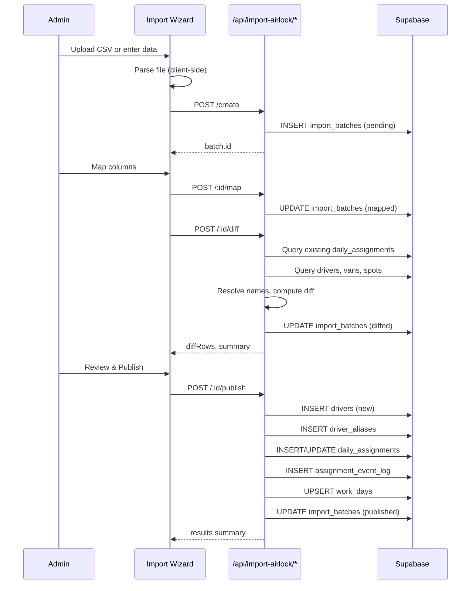

# Import Airlock Flow

> **If this documentation disagrees with code, the code wins.**
> This document describes the Import Airlock data ingestion pipeline for admins/managers.

## Overview

Multi-step import wizard for ingesting daily assignment data from CSV/Excel files, clipboard paste, or manual entry. Data flows through staging with name resolution before publishing to `daily_assignments`.

## Flow Summary

```
Source (upload/paste/manual)
         │
         ▼
   ┌─────────────┐
   │   Parse     │ ← CSV/XLSX parsing, header extraction
   └─────────────┘
         │
         ▼
   ┌─────────────┐
   │   Create    │ ← POST /api/import-airlock/create
   │   Batch     │ → stores raw_data in import_batches
   └─────────────┘
         │
         ▼
   ┌─────────────┐
   │   Column    │ ← POST /api/import-airlock/:id/map
   │   Mapping   │ → sourceHeader → normalized field
   └─────────────┘
         │
         ▼
   ┌─────────────┐
   │   Diff      │ ← POST /api/import-airlock/:id/diff
   │   Preview   │ → resolves drivers/vans, computes changes
   └─────────────┘
         │
         ▼
   ┌─────────────┐
   │   Publish   │ ← POST /api/import-airlock/:id/publish
   │   Snapshot  │ → writes to daily_assignments
   └─────────────┘
```

## Wizard Steps

### Step 1: Source Selection

Three input modes:
- **File Upload** - CSV, XLSX, XLS files
- **Clipboard Paste** - Tab or comma-delimited text
- **Manual Entry** - Direct row-by-row input form

Client-side parsing via PapaParse (CSV) and SheetJS (Excel).

### Step 2: Column Mapping

Map source columns to normalized fields:
- `work_date` - Work date (usually from filename or date picker)
- `driver_name` - Driver display name (fuzzy matched)
- `van_label` - Van identifier
- `vin` - Vehicle VIN
- `route_code` - Route/cycle code
- `pad` - Loading pad
- `dispatch_time` - Dispatch time
- `cart_location` - Cart/tote location
- `parking_spot_label` - Parking spot identifier

Auto-mapping attempts to match based on common header patterns.

### Step 3: Diff Preview

Shows before/after comparison:
- **Added** - New assignments to create
- **Updated** - Existing assignments with changes
- **Removed** - Assignments no longer in import (cleared, not deleted)
- **Unchanged** - No modifications needed
- **Unresolved** - Rows with driver/van matching issues

Name resolution uses:
- Exact match on `drivers.display_name`
- Fuzzy match via `driver_aliases.normalized_alias`
- Jaccard similarity + Levenshtein distance scoring

### Step 4: Publish

On publish:
1. Creates new drivers for unresolved names (with aliases)
2. Inserts new `daily_assignments` rows
3. Updates existing rows (only changed fields)
4. Clears removed assignments (nullifies identity fields, no hard delete)
5. Logs all changes to `assignment_event_log`
6. Updates `work_days.snapshot_version` and `content_hash`

## Sequence Diagram



## Security

### Authorization
- All endpoints require `admin` or `manager` role
- Uses `requireRole(["admin", "manager"])` from `@/lib/auth`
- Returns 401 (unauthenticated) or 403 (unauthorized) on failure

### RLS Policies
- `import_batches` - tenant-scoped SELECT/INSERT/UPDATE
- `daily_assignments` - admin/manager INSERT, tenant-scoped UPDATE
- `drivers` - admin/manager INSERT for auto-creation
- `assignment_event_log` - admin/manager INSERT

### Batch Isolation
- Each batch scoped to `tenant_id`
- Only one in-progress batch per (tenant, work_date) allowed
- Conflict returns 409 with existing batch ID

## Batch Status Lifecycle

```
pending → mapped → diffed → published
                     ↓
                 cancelled
```

## API Reference

### POST /api/import-airlock/create

Creates a new import batch.

**Request:**
```json
{
  "workDate": "2024-01-15",
  "sourceType": "upload" | "clipboard" | "manual",
  "sourceFilename": "dispatch.xlsx",
  "rawData": [{ "Driver": "John Doe", "Van": "VAN-001" }],
  "rawHeaders": ["Driver", "Van", "Route"]
}
```

**Response:**
```json
{
  "ok": true,
  "data": {
    "id": "uuid",
    "status": "pending",
    "workDate": "2024-01-15",
    "rowCount": 25
  }
}
```

### POST /api/import-airlock/:id/map

Applies column mappings.

**Request:**
```json
{
  "columnMappings": [
    { "sourceHeader": "Driver", "targetField": "driver_name", "ignored": false }
  ]
}
```

### POST /api/import-airlock/:id/diff

Computes diff against existing assignments.

**Response includes:**
- `diffRows` - Array of DiffRow objects
- `summary` - Counts: added, updated, removed, unchanged, unresolved

### POST /api/import-airlock/:id/publish

Publishes changes to production tables.

**Request:**
```json
{
  "skipUnresolved": true
}
```

**Response includes:**
- `created`, `updated`, `cleared`, `skipped` counts
- `driversCreated`, `aliasesCreated` counts
- `errors` - Any row-level errors

## Code References

| Component | File |
|-----------|------|
| Wizard UI | [`src/app/app/admin/import-airlock/wizard.tsx`](../../src/app/app/admin/import-airlock/wizard.tsx) |
| Types | [`src/lib/import-airlock/types.ts`](../../src/lib/import-airlock/types.ts) |
| Parsers | [`src/lib/import-airlock/parsers.ts`](../../src/lib/import-airlock/parsers.ts) |
| Name Resolution | [`src/lib/import-airlock/name-resolution.ts`](../../src/lib/import-airlock/name-resolution.ts) |
| Create API | [`src/app/api/import-airlock/create/route.ts`](../../src/app/api/import-airlock/create/route.ts) |
| Map API | [`src/app/api/import-airlock/[id]/map/route.ts`](../../src/app/api/import-airlock/[id]/map/route.ts) |
| Diff API | [`src/app/api/import-airlock/[id]/diff/route.ts`](../../src/app/api/import-airlock/[id]/diff/route.ts) |
| Publish API | [`src/app/api/import-airlock/[id]/publish/route.ts`](../../src/app/api/import-airlock/[id]/publish/route.ts) |
| RLS Policies | [`supabase/rls_role_policies.sql`](../../supabase/rls_role_policies.sql) |
